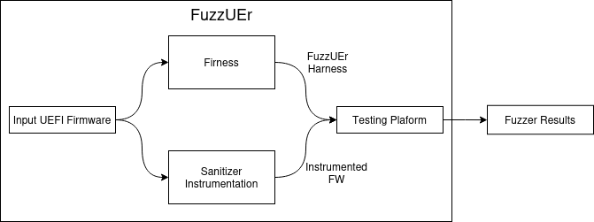

# FuzzUEr

This is the tool is designed for setting up and Fuzzing the EDK2 firmware. The tool is designed to work with [TSFFS](https://github.com/intel/tsffs).

## Research Paper

This tool was developed as part of a research project and the paper called `FuzzUEr: Enabling Fuzzing of UEFI Interfaces` that is NDSS 25 and can be found [here](https://dx.doi.org/10.14722/ndss.2025.240400).


## Overview

This repo is responsible for fuzzing the EDK2 UEFI through the use of a harness UEFI application that is reposible for creating well formed inputs to pass to other drivers. The tool generates the harness for TSFFS automatically. Everything has been configured to run within Docker containers to make it easier to use and more portable. FuzzUEr has 3 main components:

1. [Firness](https://github.com/BreakingBoot/firness)
2. [Sanitizer](https://github.com/BreakingBoot/uefi_asan)
3. Testing Platform: [TSFFS](https://github.com/intel/tsffs)



Firness and the sanitizer instrumentation both take the original firmware image as input and output the generated harness and instrumented firmware image with ASan, respectively. 

## Running FuzzUEr

There are are only two things that you will need to do in order to run the system: create a shared folder for the input firmware and the input file descibing the protocols to harness. For our experiments we have all of the source code already added as submodules within the `eval_source` directory.

And then you can add the input file containing the target functions, for example:

```
[Protocols]
  // EFI_IP4_PROTOCOL
  gEfiIp4ProtocolGuid:GetModeData
  gEfiIp4ProtocolGuid:Configure
  gEfiIp4ProtocolGuid:Groups
  gEfiIp4ProtocolGuid:Routes
  gEfiIp4ProtocolGuid:Transmit
  gEfiIp4ProtocolGuid:Receive
  gEfiIp4ProtocolGuid:Cancel
  gEfiIp4ProtocolGuid:Poll
```
This file is already included in the `eval_source` directory.

A new docker container can be created by running the following commands:
```
docker build -t fuzzuer-image .
docker run -it -v ./eval_source/:/input fuzzuer-image
```

And then you can run everything with the helper script `firness.py`:

```
root@c34bee8882e2:/workspace# python firness.py -h
usage: firness.py [-h] [-i INPUT] [-s SRC] [-a] [-f] [-r] [-g] [-t TIMEOUT] [-e]

Firness

options:
  -h, --help            show this help message and exit
  -i INPUT, --input INPUT
                        Path to the input directory with the source files or input file for single run
  -s SRC, --src SRC     Path to the source directory with edk2
  -a, --analyze         Run the static analysis tool
  -f, --fuzz            Run the fuzzer
  -r, --random          randomize the input for the static analysis tool
  -g, --generate        Generate the harness
  -t TIMEOUT, --timeout TIMEOUT
                        Timeout for the fuzzer
  -e, --eval            Evaluate the results of the static analysis tool
```

### Adding a Sanitizer
The sanitizer can be added through the patch file in the `uefi_asan` directory. The `firness.py` script also atempts to apply the path automatically and copy over the necessary files.

### Fuzzing

Once everything has been compiled then it can be run by utilizing the `fuzz.simics` in the `Harness` folder. By default it points to the location that is utilized by the `firness.py` script in the `scripts` folder. This can be run manually by calling running:

```
./simics -no-win -no-gui fuzz.simics
```

### Example

This is an example of running the system with the `eval_source` directory:

```
# build the docker image
docker build -t fuzzuer-image .

# run the docker image
docker run -it -v ./eval_source/:/input fuzzuer-image

# run the firness.py script
python firness.py -i /input/input.txt -s /input/edk2
```

This will automatically generate the compilation database, analyze the source code, generate the harness, compile the firmware and harness, and then run the fuzzer. Note: it will run the fuzzer indefinitely, so make sure to CTRL+C to stop it. The results will be in the `/workspace/firness_output` directory, where the most recent harness is in a folder called `Firness` but all generated harness are stored based on time they are generated.