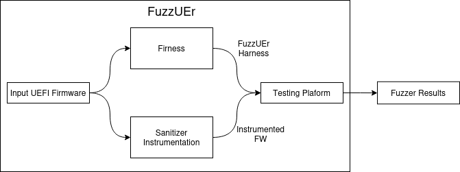

# FuzzUEr

This is the tool is designed for setting up and Fuzzing the EDK2 firmware. The tool is designed to work with [TSFFS](https://github.com/intel/tsffs).

## Research Paper

This tool was developed as part of a research project and the paper called `FuzzUEr: Enabling Fuzzing of UEFI Interfaces` that is NDSS 25 and can be found [here](https://dx.doi.org/10.14722/ndss.2025.240400).


## Overview

This repo is responsible for fuzzing the EDK2 UEFI through the use of a harness UEFI application that is reposible for creating well formed inputs to pass to other drivers. The tool generates the harness for TSFFS automatically. Everything has been configured to run within Docker containers to make it easier to use and more portable. FuzzUEr has 3 main components:

1. [Firness](https://github.com/BreakingBoot/firness)
2. [Sanitizer](https://github.com/BreakingBoot/uefi_asan)
3. Testing Platform: [TSFFS](https://github.com/intel/tsffs)



Firness and the sanitizer instrumentation both take the original firmware image as input and output the generated harness and instrumented firmware image with ASan, respectively. 

## Running FuzzUEr

There are are only two things that you will need to do in order to run the system: create a shared folder for the input firmware and the input file descibing the protocols to harness. For our experiments we have all of the source code already added as submodules within the `eval_source` directory.

And then you can add the input file containing the target functions, for example:

```
[Protocols]
  // EFI_IP4_PROTOCOL
  gEfiIp4ProtocolGuid:GetModeData
  gEfiIp4ProtocolGuid:Configure
  gEfiIp4ProtocolGuid:Groups
  gEfiIp4ProtocolGuid:Routes
  gEfiIp4ProtocolGuid:Transmit
  gEfiIp4ProtocolGuid:Receive
  gEfiIp4ProtocolGuid:Cancel
  gEfiIp4ProtocolGuid:Poll
```
This file is already included in the `eval_source` directory.

A new docker container can be created by running the following commands:
```
docker build -t fuzzuer-image .
docker run -it -v ./eval_source/:/input fuzzuer-image
```

And then you can run everything with the helper script `firness.py`:

```
python firness.py -h

  -i, --input INPUT     Input directory with the source files, or the input file
                        for a single run
  -s, --src SRC         Path to the source directory with edk2 and input.txt
  -a, --analyze         Run the static analysis tool
  -g, --generate        Generate the harness
  -f, --fuzz            Run the fuzzer
  -e, --eval            Evaluate the results of the static analysis tool
  -t, --timeout N       Fuzzing budget in seconds, counted from the moment the
                        harness is reached, not from simics startup
  --backend BACKEND     Fuzzer the generated harness targets:
                        tsffs (default) | qemu | nyx | none
  --smi                 Fuzz SMI handlers instead of protocols
  --max-steps N         Calls chained per fuzzing iteration
  --seed-corpus DIR     Start the corpus from a previous campaign's
  --snapshot            Restore projects/example/booted.ckpt instead of booting
  --make-snapshot       Boot once, write booted.ckpt, then stop
  --reproduce           Replay a saved test case instead of fuzzing
  --testcase FILE       Test case to replay with --reproduce
```

`-g` matters more than it looks: `-f` on its own fuzzes whatever harness is already
built into the image, not the one just generated for the protocol you asked for.

## Example

This is an example of running the system with the `eval_source` directory:

```
# build the docker image
docker build -t fuzzuer-image .

# run the docker image
docker run -it -v ./eval_source/:/input fuzzuer-image

# run the firness.py script
python firness.py -i /input/input.txt -s /input
```

This will automatically generate the compilation database, analyze the source code, generate the harness, compile the firmware and harness, and then run the fuzzer. Note: it will run the fuzzer indefinitely, so make sure to CTRL+C to stop it. The results will be in the `/workspace/firness_output` directory, where the most recent harness is in a folder called `Firness` but all generated harness are stored based on time they are generated.

## Backends

The harness targets one of two machines. They answer different questions, so the
choice is not just taste.

| | Simics / TSFFS | QEMU |
|---|---|---|
| speed | ~0.17 exec/s | ~7.4 exec/s |
| ASan instrumentation | yes | yes |
| how a finding surfaces | an ASan report becomes a solution | a crash or a timeout |

With `ASAN_FUZZER=qemu`, AsanLib emits the LibAFL crash handshake when it reports.
That the handshake is emitted has been checked -- stock QEMU raises `#UD` on those four
bytes, which is what `qemu_smoke.sh` keys on -- but it has not yet been confirmed
captured end to end by the LibAFL fuzzer, so treat QEMU ASan findings as crashes to
triage rather than as counted solutions.

Pick with `--backend`. The backend is compiled into the harness, so it has to be set
at generation time (`-g --backend qemu`), not just at fuzzing time.

```
# generate and fuzz under QEMU
python firness.py -i /input/input.txt -s /input -a -g -f --backend qemu
```

Two QEMU helpers stand on their own:

```
# does the harness load and reach HARNESS_START at all?  (stock QEMU, no fuzzer)
./scripts/qemu_smoke.sh path/to/Firness.efi

# fuzz it under LibAFL-QEMU, for 600 seconds by default
./scripts/qemu_fuzz.sh path/to/Firness.efi [seconds]
```

`qemu_smoke.sh` is a real test rather than a demo because the two backends give
opposite, unambiguous answers: a `--backend none` build runs to completion, while a
`--backend qemu` build raises `#UD` on the four magic bytes that stock QEMU cannot
decode. Either answer appearing for the wrong build means the backend never reached
the compiler.

## AddressSanitizer

### Adding it to a platform

Everything is in one include. Set two defines above `[LibraryClasses]` in the
platform DSC and pull it in:

```
[Defines]
  DEFINE ASAN_SCOPE  = per-module     # off | per-module | full
  DEFINE ASAN_FUZZER = tsffs          # tsffs | qemu | none

!include MdeModulePkg/Include/Dsc/Asan.dsc.inc
```

Both are overridable from the build command line, so one tree builds every variant:

```
build -a X64 -b DEBUG -t CLANGSAN -p OvmfPkg/OvmfPkgX64.dsc \
      -D ASAN_SCOPE=full -D ASAN_FUZZER=qemu -D FD_SIZE_IN_KB=8192
```

The platform still has to reserve the shadow region and publish `gAsanInfoGuid` from
PEI. Without that HOB AsanLib deactivates itself, and every instrumented access
becomes a no-op that looks exactly like a clean run. `OvmfPkg/PlatformPei/MemDetect.c`
is the worked example.

### Scope

`per-module` instruments nothing until a module opts in, which keeps the image inside
a 4MB flash. Give the module's entry in `[Components]`:

```
MdeModulePkg/Universal/HiiDatabaseDxe/HiiDatabaseDxe.inf {
  <BuildOptions>
    *_CLANGSAN_X64_SAN_FLAGS == $(ASAN_SAN_FLAGS)
  <LibraryClasses>
    AsanLib|MdeModulePkg/Library/AsanLib/AsanLib.inf
    NULL|MdeModulePkg/Library/AsanLib/AsanLib.inf
    BaseMemoryLib|MdePkg/Library/AsanMemoryLibRepStr/AsanMemoryLibRepStr.inf
}
```

`full` instruments every DXE phase module -- 265 of 277 on OVMF against 3 at
per-module -- which is what finds an error whose allocation and access are in
different drivers. It roughly triples the image, so it needs `-D FD_SIZE_IN_KB=8192`.

Three rules that are easy to get wrong, each of which cost a debugging cycle:

- **The runtime is pinned uninstrumented in its sources, not in the build files.** A
  DSC global `SAN_FLAGS ==` overrides an INF `[BuildOptions]` outright, and edk2 builds
  a library instance once, so `[Components]` cannot reach it either. The AsanLib and
  AsanMemoryLib sources carry `no_sanitize` pragmas instead, which also means they hold
  under whatever flags a platform sets.
- **Stack instrumentation is per-module on purpose.** The compiler writes frame
  redzones inline and unconditionally, past AsanLib's range guard, so a module whose
  stack falls outside the mapped shadow corrupts memory. `full` therefore adds
  `-mllvm -asan-stack=0` globally. Nothing is lost for cross-module work: a stack frame
  never outlives the function that owns it.
- **`SAN_FLAGS` is replaced with `==`, never appended with `=`.** `build_rule` puts it
  after `CC_FLAGS`, so a `-fno-sanitize` in `CC_FLAGS` has no effect.

### Checking that it actually reports

`AsanSelfTest` commits deliberate errors and says what it expects, so a silent ASan is
distinguishable from a clean run. Put it on an ESP and boot it:

```
./scripts/make_esp.sh Build/OvmfX64/DEBUG_CLANGSAN/X64/AsanSelfTest.efi esp.img
```

A working image reports the overflow, the underflow and the use-after-free with shadow
`FA`/`FD`, reports the double free, and stays silent on the control case.

## SMI fuzzing

`--smi` targets SMI handlers instead of protocols. The harness writes the buffer into
the SMM Core private data and raises the SMI, which is what `SmmCommunicationCommunicate`
does; a plain write to the command port dispatches on whatever the last DXE caller left
behind.

### From a Linux kernel module

`--host linux` emits the same harness as a kernel module, so handlers can be driven from
a running OS rather than from DXE. It reads the firmware's `FirnessSmmInfo` variable out
of `/sys/firmware/efi/efivars` for the addresses it needs.

```
python firness/harness_generator/main.py --smi --host linux --backend none \
    --edk2 eval_source/edk2 -i eval_source/evalset/SmiTest.txt \
    -sm <cache>/smi-function-guid-map.json ... -o out/
```

Build the module against the guest's kernel, then load it:

```
insmod firness_smi.ko comm_phys=$COMM comm_size=$COMMSZ \
       bufptr_phys=$BUFPTR bufsize_phys=$BUFSZ smi_port=$PORT target=2
```

`insmod` answering `-ENODEV` is the designed path: the work happens in module init and
the module unloads itself. `target=<n>` picks one handler; without a fuzzer attached the
input is all zeroes, so the choice byte is always 0 and only the first handler is ever
reached.

Three things that are not obvious:

- **The guest usually has no toolchain and no kernel headers.** Cross-build the `.ko`
  against matching headers (the vermagic has to match exactly), strip it, and hand it to
  the guest as a raw disk rather than installing a compiler in the target.
- **X64 plus SMM needs `-global ICH9-LPC.disable_s3=1`**, or OVMF asserts in
  `Platform.c` before any driver runs.
- **Start from a fresh `OVMF_VARS` copy each run.** Reusing a written one lands the
  guest in the UEFI Shell, because the earlier boot rewrote the boot order.

`scripts/guest_run.py` drives the whole thing over the guest's serial console and can
capture the firmware debug port with `--fw-log`, which is the only place OVMF's DEBUG
output goes:

```
python scripts/guest_run.py --code OVMF_CODE.fd --vars VARS.fd --disk guest.qcow2 \
    --extra-disk ko.img --script run.sh --fw-log fw.log
```

To confirm a handler really ran rather than just an SMI being raised, look for the SMM
core's dispatch line in `--fw-log`. `Success` means a handler registered for that GUID
executed; `Not Found` means none was:

```
SmmCore: dispatch 2A3CFEBD-27E8-4D0A-8B79-D688C2A3E1C0 len 0 -> Success
```

## Triage

A campaign's solution count is not a bug count. Most reports are the harness, not the
firmware, so check the module a report is attributed to before chasing it:

```
python scripts/triage_crashes.py
python scripts/symbolize.py       # raw addresses -> module names
```

Group reports by return IP first. A single site dominating the count is a scanner or a
loop rather than N bugs.
