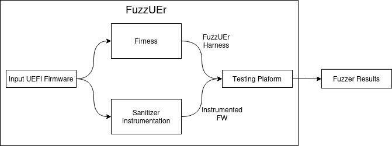

# FuzzUEr

This is the tool is designed for setting up and Fuzzing the EDK2 firmware. The tool is designed to work with [TSFFS](https://github.com/intel/tsffs).

## Research Paper

This tool was developed as part of a research project and the paper called `FuzzUEr: Enabling Fuzzing of UEFI Interfaces` that is NDSS 25 and can be found [here](https://dx.doi.org/10.14722/ndss.2025.240400).


## Overview

This repo is responsible for fuzzing the EDK2 UEFI through the use of a harness UEFI application that is reposible for creating well formed inputs to pass to other drivers. The tool generates the harness for TSFFS automatically. Everything has been configured to run within Docker containers to make it easier to use and more portable. FuzzUEr has 3 main components:

1. [Firness](https://github.com/BreakingBoot/firness)
2. [Sanitizer](https://github.com/BreakingBoot/uefi_asan)
3. Testing Platform: [TSFFS](https://github.com/intel/tsffs)



Firness and the sanitizer instrumentation both take the original firmware image as input and output the generated harness and instrumented firmware image with ASan, respectively. 

## Running FuzzUEr

There are are only two things that you will need to do in order to run the system: create a shared folder for the input firmware and the input file descibing the protocols to harness. For our experiments we have all of the source code already added as submodules within the `eval_source` directory.

And then you can add the input file containing the target functions, for example:

```
[Protocols]
  // EFI_IP4_PROTOCOL
  gEfiIp4ProtocolGuid:GetModeData
  gEfiIp4ProtocolGuid:Configure
  gEfiIp4ProtocolGuid:Groups
  gEfiIp4ProtocolGuid:Routes
  gEfiIp4ProtocolGuid:Transmit
  gEfiIp4ProtocolGuid:Receive
  gEfiIp4ProtocolGuid:Cancel
  gEfiIp4ProtocolGuid:Poll
```
This file is already included in the `eval_source` directory.

A new docker container can be created by running the following commands:
```
docker build -t fuzzuer-image .
docker run -it -v ./eval_source/:/input fuzzuer-image
```

And then you can run everything with the helper script `firness.py`:

```
python firness.py -h

  -i, --input INPUT     Input directory with the source files, or the input file
                        for a single run
  -s, --src SRC         Path to the source directory with edk2 and input.txt
  -a, --analyze         Run the static analysis tool
  -g, --generate        Generate the harness
  -f, --fuzz            Run the fuzzer
  -e, --eval            Evaluate the results of the static analysis tool
  -t, --timeout N       Fuzzing budget in seconds, counted from the moment the
                        harness is reached, not from simics startup
  --backend BACKEND     Fuzzer the generated harness targets:
                        tsffs (default) | qemu | nyx | none
  --smi                 Fuzz SMI handlers instead of protocols
  --max-steps N         Calls chained per fuzzing iteration
  --seed-corpus DIR     Start the corpus from a previous campaign's
  --snapshot            Restore projects/example/booted.ckpt instead of booting
  --make-snapshot       Boot once, write booted.ckpt, then stop
  --reproduce           Replay a saved test case instead of fuzzing
  --testcase FILE       Test case to replay with --reproduce
```

`-g` matters more than it looks: `-f` on its own fuzzes whatever harness is already
built into the image, not the one just generated for the protocol you asked for.

## Example

This is an example of running the system with the `eval_source` directory:

```
# build the docker image
docker build -t fuzzuer-image .

# run the docker image
docker run -it -v ./eval_source/:/input fuzzuer-image

# run the firness.py script
python firness.py -i /input/input.txt -s /input
```

This will automatically generate the compilation database, analyze the source code, generate the harness, compile the firmware and harness, and then run the fuzzer. Note: it will run the fuzzer indefinitely, so make sure to CTRL+C to stop it. The results will be in the `/workspace/firness_output` directory, where the most recent harness is in a folder called `Firness` but all generated harness are stored based on time they are generated.

## Backends

The harness targets one of two machines. They answer different questions, so the
choice is not just taste.

| | Simics / TSFFS | QEMU |
|---|---|---|
| ASan instrumentation | yes | yes |
| a sanitizer report becomes a counted solution | yes | yes |
| protocols installed by the platform | see note | 89 of 246 on OvmfPkgX64 |
| speed | not re-measured | median 1.35 exec/s, range 0.03-10.2 |

Both numbers in that last row used to read "~0.17 exec/s" and "~7.4 exec/s", and the prose
below the table called QEMU forty times faster. Neither claim survives: the QEMU figure is
the top of its range rather than a typical campaign, measured over 85 campaigns of a master
sweep, and a later Simics measurement put Simics ahead by roughly an order of magnitude on
the protocols the two share. **Treat the comparison as open until both are measured in the
same week on the same protocols** -- only 66 protocols exist on both backends, so outside
that set the comparison is between platform builds, not between backends.

With `ASAN_FUZZER=qemu`, AsanLib emits the LibAFL crash handshake when it reports, and that
is now confirmed end to end rather than inferred. In one benchmark campaign the firmware
emitted 3628 `FWSAN: interface` reports and 3283 `FWSAN: double-fetch` reports, and LibAFL
recorded exactly 6911 objectives -- every report became a counted solution. Reports are also
parsed out of the serial capture into `crashes.csv` and attributed to a module, so a finding
is actionable whether or not it escalated.

A caveat that still holds: most objectives in a typical campaign are crashes and timeouts
rather than escalated sanitizer reports, so an objective count is not a bug count. Group by
return IP and read the Module column -- `scripts/bug_report.py` does both.

Pick with `--backend`. The backend is compiled into the harness, so it has to be set
at generation time (`-g --backend qemu`), not just at fuzzing time.

```
# generate and fuzz under QEMU
python firness.py -i /input/input.txt -s /input -a -g -f --backend qemu
```

Two QEMU helpers stand on their own:

```
# does the harness load and reach HARNESS_START at all?  (stock QEMU, no fuzzer)
./scripts/qemu_smoke.sh path/to/Firness.efi

# fuzz it under LibAFL-QEMU, for 600 seconds by default
./scripts/qemu_fuzz.sh path/to/Firness.efi [seconds]
```

`qemu_smoke.sh` is a real test rather than a demo because the two backends give
opposite, unambiguous answers: a `--backend none` build runs to completion, while a
`--backend qemu` build raises `#UD` on the four magic bytes that stock QEMU cannot
decode. Either answer appearing for the wrong build means the backend never reached
the compiler.

## Running it under QEMU, end to end

Simics is what the paper used; QEMU needs no licence, which is the reason to reach for it.
See the table above on speed -- the old "forty times faster" claim does not hold. The whole
path, from nothing to a campaign:

**1. Build the firmware with ASan and the QEMU backend.** `ASAN_FUZZER=qemu` is what makes
a finding reach the fuzzer rather than only the log.

```
export WORKSPACE=$PWD/eval_source/edk2 EDK_TOOLS_PATH=$WORKSPACE/BaseTools
export CONF_PATH=$WORKSPACE/Conf CLANGSAN_BIN=/path/to/llvm/bin/
cd $WORKSPACE && make -C BaseTools && source edksetup.sh
build -a X64 -b DEBUG -t CLANGSAN -p OvmfPkg/OvmfPkgX64.dsc \
      -D ASAN_SCOPE=per-module -D ASAN_FUZZER=qemu
```

**2. Build the fuzzer.** It compiles its own QEMU, so the first build is long.

```
cd Harness/qemu_fuzzer && cargo build --release
```

**3. Generate a harness for the QEMU backend.** The backend is compiled in, so it has to
be chosen at generation time.

```
python scripts/firness.py -i /input/input.txt -s /input -a -g --backend qemu
```

**4. Check it loads before spending a campaign on it.**

```
OVMF_CODE=.../OVMF_CODE.fd ./scripts/qemu_smoke.sh .../Firness.efi
```

**5. Fuzz it.**

```
export FIRNESS_OVMF_CODE=$WORKSPACE/Build/OvmfX64/DEBUG_CLANGSAN/FV/OVMF_CODE.fd
export FIRNESS_OVMF_VARS=$WORKSPACE/Build/OvmfX64/DEBUG_CLANGSAN/FV/OVMF_VARS.fd
export FIRNESS_TIMEOUT=60
./scripts/qemu_fuzz.sh .../Firness.efi 600
```

Three of these are easy to get wrong, and each fails quietly:

- **`FIRNESS_OVMF_CODE` is not optional.** Left unset the fuzzer runs the distribution
  OVMF, which has no ASan in it at all. The campaign then reports crashes and timeouts
  only and looks like a clean target; that is what "objectives: 0" meant here for a whole
  afternoon. The script warns about it now.
- **`FIRNESS_TIMEOUT` defaults to 10 seconds**, which an instrumented boot can exceed. Every
  iteration then ends as a timeout, and a real crash is indistinguishable from one. If
  every input is an objective and the corpus stays empty, raise it before believing
  anything.
- **The emulator is linked into the fuzzer**, so it has no data directory and looks for its
  roms relative to the working directory. `qemu_fuzz.sh` now finds the bridge checkout's
  `pc-bios` itself; if it cannot, set `FIRNESS_QEMU_BIOS_DIR`.

To confirm the reporting path end to end rather than trusting it, fuzz `AsanSelfTest.efi`
instead of a harness. Seeded with a first byte of 0 it commits a heap overflow and the
fuzzer records an objective about a second after the boot; seeded with 4 it does the same
allocation correctly and produces nothing but a timeout.

## One command per EDK2 version

`scripts/fuzz_edk2.py` takes a ref and goes as far as a bug report. It is what the
GitHub workflow runs, once per version.

```
scripts/bootstrap_runner.sh                          # once per machine
python3 scripts/fuzz_edk2.py --ref edk2-stable202511
```

Eleven stages, each printing PASS or FAIL with what it saw. The run stops at the first
failure, because every stage after one would report a number that looks like a result:

| stage | what it answers |
| --- | --- |
| `ready` | are the images and the builder container here |
| `fetch` | is the ref real, and checked out |
| `submodules` | edk2 vendors its dependencies; three separate build failures name none of them |
| `port` | did the sanitizer integration apply, and how much of it merged cleanly |
| `build` | did the firmware build |
| `instrumented` | do modules actually carry `__asan_load`/`__asan_store` -- "applied" is not "instrumented" |
| `discover` | protocols from headers, SMI handlers from registration call sites |
| `image` | a campaign image holding *this* tree, so the harness is built from the version under test |
| `detects` | does the sanitizer report a deliberate error in this build's own firmware |
| `fuzz` | the campaigns, and how many reached the harness |
| `triage` | cluster, separate the harness and the PCI hole from the firmware, name a driver |

`--skip-fuzz` stops after `detects`, which is the useful form for asking "does this
version port, build and report at all" without spending a fuzzing budget.

Two stages exist because of what they caught. `image` is there because campaigns
generate and build their harness from the tree inside the image: without a per-version
image, every version in a matrix is fuzzed against whichever edk2 the image shipped and
the result is filed under the ref the matrix named. `detects` builds the tree a second
time with `-D ASAN_FUZZER=none`, because under the LibAFL backend the runtime reports by
executing a custom instruction that is an invalid opcode outside LibAFL -- the guest dies
in CpuDxe before BDS launches the self test, which looks exactly like firmware with no
bugs in it.

### On a runner

`.github/workflows/fuzz-edk2.yml` runs the bootstrap and then the driver over a list of
refs, and writes one table saying which stages each version passed.

It needs a **self-hosted** runner labelled `self-hosted, linux, x64`. Register one with:

```
scripts/setup_gh_runner.sh <registration-token>   # Settings -> Actions -> Runners
scripts/bootstrap_runner.sh                       # then the images, once per machine
```

Without a runner the schedule has nothing to execute on and never starts -- and there is
no failed run to notice either, so check `Settings -> Actions -> Runners` shows one idle
before trusting the weekly sweep.

The first run on a cold machine builds LLVM 15 from source, installs the Simics packages,
and builds QEMU through libafl -- hours, not minutes. Every bootstrap step checks for its
own output first, so later runs cost seconds. Budget ~60 GB of disk for the images and one
campaign image per version, and expect Docker to hold considerably more than that over
time: campaign containers are removed as they finish, but rebuilt images leave untagged
layers behind that only `docker image prune` clears.

Run it manually once with **qualify_only** before trusting a full sweep: ten stages, a few
minutes, and it exercises everything except the fuzzing. A full matrix is ~17 hours.

### Which versions it works on

Every upstream stable tag from `edk2-stable202305` to `edk2-stable202608`, and `master`.
These are tianocore's own commits -- `edk2-stable202505` here is `6951dfe7d59d`, which is
what `git ls-remote https://github.com/tianocore/edk2.git` returns for that tag. For each
one the port applies with nothing unresolved, the firmware builds, the built modules carry
ASan checks, and the self test catches a double free, an overflow, an underflow, a
use-after-free and a length-driven overread in that version's own firmware.

| version | port | instrumented | protocols found |
| --- | --- | --- | --- |
| edk2-stable202305 | 29 clean, 0 resolved | 218/220 | 249 |
| edk2-stable202308 | 28 clean, 1 resolved | 218/220 | 250 |
| edk2-stable202311 | 27 clean, 2 resolved | 220/222 | 250 |
| edk2-stable202402 | 25 clean, 4 resolved | 218/220 | 244 |
| edk2-stable202405 | 25 clean, 4 resolved | 222/224 | 247 |
| edk2-stable202408 | 24 clean, 5 resolved | 228/230 | 247 |
| edk2-stable202411 | 23 clean, 6 resolved | 228/228 | 248 |
| edk2-stable202502 | 21 clean, 7 resolved | 232/232 | 247 |
| edk2-stable202505 | 19 clean, 9 resolved | 236/236 | 247 |
| edk2-stable202508 | 19 clean, 9 resolved | 242/242 | 245 |
| edk2-stable202511 | 19 clean, 9 resolved | 242/242 | 243 |
| edk2-stable202602 | 19 clean, 9 resolved | 242/242 | 242 |
| edk2-stable202605 | 20 clean, 8 resolved | 244/244 | 243 |
| edk2-stable202608 | 20 clean, 8 resolved | 246/246 | 244 |
| master | 20 clean, 8 resolved | 242/242 | 242 |

The "resolved" column is how many of the port's 30 modified files needed a conflict
resolved rather than merging outright, and it tracks distance from the commit the port
sits on: nothing to resolve on the tags nearest it, nine on the ones furthest away.

None of this makes the next release safe by assumption. Each of the versions above
needed something, and the something was different every time -- a toolchain flag edk2
added, a build rule section it split, a firmware volume it moved, a driver it now ships
itself. What the port does is fail loudly on each: `port` refuses to leave a conflict
unresolved, `instrumented` counts the modules that actually carry ASan checks rather than
trusting the build, and `detects` makes the sanitizer catch a deliberate error in the
firmware it just built.

A campaign on 202505 reaches the harness and fuzzes: 58,786 iterations over 1,196 edges
for EFI_BLOCK_IO_PROTOCOL in a 300 second budget, and the triage names a finding by
module, file and line.

## AddressSanitizer

### Adding it to a platform

Everything is in one include. Set two defines above `[LibraryClasses]` in the
platform DSC and pull it in:

```
[Defines]
  DEFINE ASAN_SCOPE  = per-module     # off | per-module | full
  DEFINE ASAN_FUZZER = tsffs          # tsffs | qemu | none

!include MdeModulePkg/Include/Dsc/Asan.dsc.inc
```

Both are overridable from the build command line, so one tree builds every variant:

```
build -a X64 -b DEBUG -t CLANGSAN -p OvmfPkg/OvmfPkgX64.dsc \
      -D ASAN_SCOPE=full -D ASAN_FUZZER=qemu -D FD_SIZE_IN_KB=8192
```

The platform still has to reserve the shadow region and publish `gAsanInfoGuid` from
PEI. Without that HOB AsanLib deactivates itself, and every instrumented access
becomes a no-op that looks exactly like a clean run. `OvmfPkg/PlatformPei/MemDetect.c`
is the worked example.

### Applying it to a version of EDK2

```
python3 uefi_asan/apply_asan.py --to <edk2 tree>
```

That is the whole of it. `--from` names the tree the integration is taken from and
defaults to `eval_source/edk2` beside this repository; `--base` is the commit that
integration sits on and is known to the tool. `scripts/fuzz_edk2.py` calls exactly this,
so the workflow and a person at a terminal apply the sanitizer the same way.

The tool lives with the sanitizer rather than with the pipeline because that is what it
is: the way to put this sanitizer on an edk2, not something one harness does privately.
It applies 81 added files and three-way merges 30 modified ones, then repairs what the
merge cannot know about -- a toolchain flag this edk2 has added, a build rule section it
has split, a firmware volume it has moved, a driver it now ships itself. It refuses to
leave a conflict unresolved rather than producing a tree that builds and is not
instrumented.

### Porting to a fresh EDK2 tree, by hand

The sanitizer is five libraries, two headers and a patch. Against a clean upstream
checkout:

```
# 1. the libraries and headers, copied in
cp -r uefi_asan/AsanLib          <edk2>/MdeModulePkg/Library/
cp -r uefi_asan/AsanLibNull      <edk2>/MdeModulePkg/Library/
cp -r uefi_asan/AsanRuntimeLib   <edk2>/MdeModulePkg/Library/
cp -r uefi_asan/AsanMemoryLib        <edk2>/MdePkg/Library/
cp -r uefi_asan/AsanMemoryLibRepStr  <edk2>/MdePkg/Library/
cp uefi_asan/Asan.h     <edk2>/MdeModulePkg/Include/Library/
cp uefi_asan/AsanInfo.h <edk2>/MdeModulePkg/Include/Guid/

# 2. the patch, which is the part that touches upstream files
patch -p1 --forward --batch --binary -d <edk2> < uefi_asan/asan.patch
```

`scripts/firness.py` does both of these itself; the manual form is for a tree it does not
manage. The patch touches the toolchain definition (`BaseTools/Conf/tools_def.template`
adds the `CLANGSAN` toolchain, `build_rule.template` adds the `SANITIZER` build rule and
its nasm command), the DXE and SMM cores so the allocator can poison and quarantine
(`Core/Dxe/Mem/Page.c`, `Mem/Pool.c`, `Core/PiSmmCore`), and a few call sites.

Then, per platform:

- **Declare the HOB guid.** `gAsanInfoGuid` has to be in `MdeModulePkg.dec` under
  `[Guids]`. The patch adds it; check it survived a merge.
- **Include the DSC fragment** and set the two defines, as above.
- **Reserve the shadow and publish the HOB from PEI.** This is the one part that is
  genuinely platform specific, and the one whose absence is silent: without the HOB
  AsanLib deactivates itself and every instrumented access becomes a no-op.
  `OvmfPkg/PlatformPei/MemDetect.c` (`AsanInitializeShadowMemory`) is 20 lines and is the
  model -- reserve `LowMemory >> 3` bytes at `0x5000000`, zero it, and
  `BuildGuidDataHob (&gAsanInfoGuid, ...)`.
- **Resolve `AsanLib` for every module type the platform builds.** A core INF that calls
  into the runtime -- `DxeMain`, `PiSmmCore`, `BootScriptExecutorDxe` -- consumes the class
  by name, so a platform that resolves it for only some phases stops with "Instance of
  library class [AsanLib] is not found".
- **Build with `-t CLANGSAN`**, and point `CLANGSAN_BIN` at a clang whose ASan pass matches
  the runtime's expectations. Clang 15 is what this tree is built and tested with.

Then run `AsanSelfTest` before trusting a single result.

### Scope

`per-module` instruments nothing until a module opts in, which keeps the image inside
a 4MB flash. Give the module's entry in `[Components]`:

```
MdeModulePkg/Universal/HiiDatabaseDxe/HiiDatabaseDxe.inf {
  <BuildOptions>
    *_CLANGSAN_X64_SAN_FLAGS == $(ASAN_SAN_FLAGS)
  <LibraryClasses>
    AsanLib|MdeModulePkg/Library/AsanLib/AsanLib.inf
    NULL|MdeModulePkg/Library/AsanLib/AsanLib.inf
    BaseMemoryLib|MdePkg/Library/AsanMemoryLibRepStr/AsanMemoryLibRepStr.inf
}
```

`full` instruments every DXE phase module -- 265 of 277 on OVMF against 3 at
per-module -- which is what finds an error whose allocation and access are in
different drivers. It roughly triples the image, so it needs `-D FD_SIZE_IN_KB=8192`.

Three rules that are easy to get wrong, each of which cost a debugging cycle:

- **The runtime is pinned uninstrumented in its sources, not in the build files.** A
  DSC global `SAN_FLAGS ==` overrides an INF `[BuildOptions]` outright, and edk2 builds
  a library instance once, so `[Components]` cannot reach it either. The AsanLib and
  AsanMemoryLib sources carry `no_sanitize` pragmas instead, which also means they hold
  under whatever flags a platform sets.
- **Stack instrumentation is per-module on purpose.** The compiler writes frame
  redzones inline and unconditionally, past AsanLib's range guard, so a module whose
  stack falls outside the mapped shadow corrupts memory. `full` therefore adds
  `-mllvm -asan-stack=0` globally. Nothing is lost for cross-module work: a stack frame
  never outlives the function that owns it.
- **`SAN_FLAGS` is replaced with `==`, never appended with `=`.** `build_rule` puts it
  after `CC_FLAGS`, so a `-fno-sanitize` in `CC_FLAGS` has no effect.

### Checking that it actually reports

`AsanSelfTest` commits deliberate errors and says what it expects, so a silent ASan is
distinguishable from a clean run. Put it on an ESP and boot it:

```
./scripts/make_esp.sh Build/OvmfX64/DEBUG_CLANGSAN/X64/AsanSelfTest.efi esp.img
```

A working image reports the overflow, the underflow and the use-after-free with shadow
`FA`/`FD`, reports the double free, and stays silent on the control case.

## Ground truth: the benchmark drivers

Nothing downstream means anything until a deliberate error has been seen caught, and a
sanitizer that reports nothing looks exactly like firmware with no bugs in it. Two sets of
drivers exist for that, built only when asked and never shipped.

`AsanSelfTest` is the small one: five heap classes in a UEFI application, exercised on every
pipeline run by the `detects` stage. It proves the shadow is mapped and the runtime reports.
What it cannot prove is that a *separately built and separately instrumented driver* reports
when reached through a protocol call, which is the path a campaign actually exercises.

`SanBenchDxe` is the larger one, and that is the path it covers. It publishes two protocols
whose members each hide a fault behind a condition an input has to satisfy, and
`SanBenchDrive` calls each one from an application:

| class | what it is | detected |
|---|---|---|
| heap-buffer-overflow | copy past a fixed allocation | yes |
| heap-buffer-underflow | read one entry below a table | yes |
| tlv-overread | header read from a blob too small to hold it | yes |
| size-overflow | wrapped `Count * sizeof` | yes |
| use-after-free | read through a released slot | yes |
| double-free | release the same slot twice | yes |
| foreign-pointer | dereference a region the driver does not own | yes (FWSAN) |
| double-fetch | untrusted word read twice in one call | yes (FWSAN) |
| stale-interface | read through an uninstalled interface | yes (FWSAN) |
| variable-size-trusted | `GetVariable` reissued into a known-small buffer | yes (FWSAN) |
| boot-service-after-exit | a boot service called after ExitBootServices | not attemptable |

Score it with one boot per class, which is the only way the two destructive cases do not
take the rest of the run with them:

```bash
python3 scripts/bench_cases.py --code OVMF_CODE.fd --vars OVMF_VARS.fd \
    --app SanBenchDrive.efi --out cases --roms /workspace/qemu_fw
```

Eleven of eleven are detected. The twelfth, `boot-service-after-exit`, needs the runtime
phase and an application under BDS is by definition before it -- it is reported "not
attempted" rather than counted as a miss, because a benchmark that hides its own gaps is
worth less than one that names them. The remaining blind spot is stack memory: the build
carries `-mllvm -asan-stack=0` because enabling stack instrumentation faults the boot in
CpuDxe, so a stack overread of any shape is invisible.

Pass `--bench` to `scripts/fuzz_edk2.py` to build these into the firmware and fuzz them, and
the `detects` stage then scores all eleven and fails on any class that regresses.

## The firmware sanitizer

ASan and UBSan find memory errors. Four classes matter in firmware and are invisible to
both, because the memory involved is perfectly valid:

- **foreign-region access** -- a dereference into flash, the legacy BIOS window, or any
  region the calling driver does not own. The shape of an SMM callout. Regions are registered
  by `FwSanDxe` and checked before the shadow lookup, because flash has no shadow.
- **double fetch** -- a word read twice from memory something outside the firmware can still
  change between the two reads. Validate with one read, use another.
- **stale interface** -- a read through a protocol interface after it has been uninstalled.
  `FwSanDxe` hooks `UninstallProtocolInterface` and poisons the storage.
- **variable-size-trusted** -- `GetVariable` reissued into a destination already known to be
  too small.

A harness declares which buffers are untrusted around each call, which is what gives the
double-fetch check something to watch; without that a double fetch is just two ordinary
reads. Findings are emitted in the same shape ASan uses, so they reach `crashes.csv` and
triage with a module and a return IP rather than being narration only.

This found a real one: `UefiDevicePathLib` reads a caller-supplied device path node's `Type`
and `SubType` twice within one `ConvertDevicePathToText` call --
`DevicePathUtilities.c:130` and `:152`.

## Checks

Each of these asserts something a passing build does not:

| script | what it asserts |
|---|---|
| `detect_check.py` | a deliberate error is still reported, and the correct case is not |
| `bench_cases.py` | all eleven benchmark classes, one boot each |
| `harness_check.py` | every requested protocol member is generated and dispatchable |
| `asan_sync_check.py` | the two copies of the sanitizer have not drifted |
| `input_check.py` | the guest actually received the testcase, not just its length |
| `protocol_presence.py` | which protocols the firmware installs, so absent ones are skipped |
| `build_sweep.sh` | every harness links with the real toolchain |

`verify_all.sh` runs the ones that do not need a campaign. `scripts/fuzz_edk2.py` gates on
`detect_check`, the benchmark, the presence census and `input_check` as pipeline stages.

## SMI fuzzing

`--smi` targets SMI handlers instead of protocols. The harness writes the buffer into
the SMM Core private data and raises the SMI, which is what `SmmCommunicationCommunicate`
does; a plain write to the command port dispatches on whatever the last DXE caller left
behind.

### From a Linux kernel module

`--host linux` emits the same harness as a kernel module, so handlers can be driven from
a running OS rather than from DXE. It reads the firmware's `FirnessSmmInfo` variable out
of `/sys/firmware/efi/efivars` for the addresses it needs.

```
python firness/harness_generator/main.py --smi --host linux --backend none \
    --edk2 eval_source/edk2 -i eval_source/evalset/SmiTest.txt \
    -sm <cache>/smi-function-guid-map.json ... -o out/
```

Build the module against the guest's kernel, then load it:

```
insmod firness_smi.ko comm_phys=$COMM comm_size=$COMMSZ \
       bufptr_phys=$BUFPTR bufsize_phys=$BUFSZ smi_port=$PORT target=2
```

`insmod` answering `-ENODEV` is the designed path: the work happens in module init and
the module unloads itself. `target=<n>` picks one handler; without a fuzzer attached the
input is all zeroes, so the choice byte is always 0 and only the first handler is ever
reached.

**Cross handler state.** `chain=<n>` calls n handlers before the iteration ends, so one
runs against whatever the previous one left behind. That is the only way to reach a bug
where a handler stores something -- a length, an NVRAM variable -- that a different handler
later trusts; with one call per iteration the second handler never sees the first one's
state. `target` then steps rather than pins, so `chain=4 target=0` dispatches handlers
0, 1, 2, 3 in order, which is deterministic without a fuzzer attached.

Two limits worth knowing before reading anything into a chained run:

- With `--backend none` every generated length field reads zero, so the handlers reject
  the buffer and no state actually crosses. A chain only carries data with a fuzzer
  supplying non-empty messages.
- **SMM code is not instrumented.** `Asan.dsc.inc` excludes `SMM_CORE` and
  `DXE_SMM_DRIVER`, because SMM needs its own shadow and its own runtime and that is not
  wired up. A memory error inside a handler is therefore not an ASan finding here; what
  surfaces is an ASSERT, a crash or a timeout, which is how the VarCheckPolicy defect was
  found.

Three things that are not obvious:

- **The guest usually has no toolchain and no kernel headers.** Cross-build the `.ko`
  against matching headers (the vermagic has to match exactly), strip it, and hand it to
  the guest as a raw disk rather than installing a compiler in the target.
- **X64 plus SMM needs `-global ICH9-LPC.disable_s3=1`**, or OVMF asserts in
  `Platform.c` before any driver runs.
- **Start from a fresh `OVMF_VARS` copy each run.** Reusing a written one lands the
  guest in the UEFI Shell, because the earlier boot rewrote the boot order.

`scripts/guest_run.py` drives the whole thing over the guest's serial console and can
capture the firmware debug port with `--fw-log`, which is the only place OVMF's DEBUG
output goes:

```
python scripts/guest_run.py --code OVMF_CODE.fd --vars VARS.fd --disk guest.qcow2 \
    --extra-disk ko.img --script run.sh --fw-log fw.log
```

To confirm a handler really ran rather than just an SMI being raised, look for the SMM
core's dispatch line in `--fw-log`. `Success` means a handler registered for that GUID
executed; `Not Found` means none was:

```
SmmCore: dispatch 2A3CFEBD-27E8-4D0A-8B79-D688C2A3E1C0 len 0 -> Success
```

## Network and network boot fuzzing

A protocol harness calls a protocol member with fuzzed arguments. That reaches the API
surface of the network stack and almost none of its parsing: what `Dhcp4Dxe`, `Mtftp4Dxe`
and `UefiPxeBcDxe` spend their code on is bytes that arrived from somewhere else, and
nothing was ever on the other end of the wire.

`scripts/net_peer.py` is that other end -- a server whose every reply is built from an
input file. QEMU's socket netdev hands the guest's NIC straight to a process, so this
needs no tap device, no root and no host networking:

```
-netdev socket,id=n0,connect=127.0.0.1:5555 -device virtio-net-pci,netdev=n0
```

It speaks ARP, ICMP, DHCP and TFTP -- enough to PXE boot a UEFI guest. Run it by hand to
watch an exchange:

```
python3 scripts/net_peer.py --port 5555 --serve-file some.efi
```

A healthy run prints the whole boot: `DHCP DISCOVER -> OFFER`, `DHCP REQUEST -> ACK`,
`ARP who-has`, `TFTP RRQ`, then `TFTP transfer complete, 29 block(s)`. The guest then
executes what it was handed, so a real application in `--serve-file` puts the PE loader
and everything that application touches in range as well.

`scripts/net_fuzz.py` is the loop around it:

```
python3 scripts/net_fuzz.py --code OVMF_CODE.fd --vars OVMF_VARS.fd \
    --serve-file some.efi --iterations 20 --mutate 8 --mutate-labels DATA
```

`--mutate-labels` picks which replies to corrupt -- `OFFER`, `ACK`, `OACK`, `DATA` -- and
choosing it is most of the skill:

| target | reaches | what a run looks like |
|---|---|---|
| `DATA` | TFTP block handling, then the PE loader | 232 mutations into a 40KB image, `start failed: Unsupported` |
| `OFFER,ACK` | the DHCP option parser | exchange completes, PXE gives up expanding the boot path |
| `OACK` | option negotiation | the transfer aborts before a block is sent |

Three things that took a measurement each to get right:

- **The BOOTP header is 236 bytes, not 240.** Four bytes of padding in front of the magic
  cookie is enough for the client to reject the offer and go back to DISCOVER, which looks
  exactly like a guest that cannot see the server.
- **TFTP needs a fresh server port per transfer.** RFC 1350 gives each transfer its own
  TID and the client sends its ACKs there; answering from port 69 got one DATA out and
  never an ACK back. PXE also asks for `blksize`/`tsize`, which want an OACK first.
- **Corrupt the payload, not the framing.** Mutations in the BOOTP header or in an OACK
  end the exchange before the parser under test runs, so the DHCP replies protect their
  first 236 bytes and `--mutate-labels DATA` is the default.

`net_fuzz.py` takes a baseline with no mutations before it starts and counts only
reporting sites beyond it. An instrumented boot raises the same 23 every time, so a run
that counted reports would call every iteration a finding -- the same trap as
[Triage](#triage) below.

## Triage

A campaign's solution count is not a bug count. Most reports are the harness, not the
firmware, so check the module a report is attributed to before chasing it:

```
python scripts/triage_crashes.py
python scripts/symbolize.py       # raw addresses -> module names
```

Group reports by return IP first. A single site dominating the count is a scanner or a
loop rather than N bugs.
