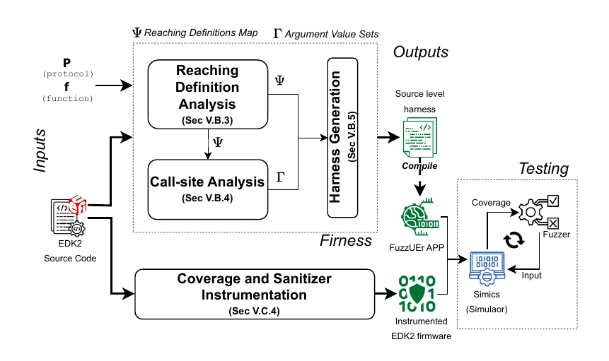

# FuzzUEr

This is the tool is designed for setting up and Fuzzing the EDK2 firmware. The tool is designed to work with either [kAFL](https://github.com/IntelLabs/kAFL) or [TSFFS](https://github.com/intel/tsffs).

## Overview

This repo is responsible for fuzzing the EDK2 UEFI through the use of a harness UEFI application that is reposible for creating well formed inputs to pass to other drivers. The tool generates the harness for both kAFL and TSFFS automatically. Everything has been configured to run within Docker containers to make it easier to use and more portable. FuzzUEr has 3 main components:

1. [Firness](https://github.com/BreakingBoot/firness)
2. [Sanitizer]()
3. Testing Platform: [kAFL](https://github.com/IntelLabs/kAFL) or [TSFFS](https://github.com/intel/tsffs)



Firness and the sanitizer instrumentation both take the original firmware image as input and output the generated harness and instrumented firmware image with ASan, respectively. The whole system is neatly package in a Docker compose file, so it can be run end-to-end without the need for intervention, unless you want to customize different steps.

## Running FuzzUEr

Once you get all of the code, with:

```
git clone git@github.com:BreakingBoot/FuzzUEr.git
cd FuzzUEr && git submodule update --init --recursive
```

There are are only two things that you will need to do in order to run the system: create a shared folder for the input firmware and run the Docker compose file.

```
mkdir input_FW
export FUZZER_OPTION=1 # 1 for running inside of Simics and 0 for QEMU
docker-compose up
```

### Generating the Harness

### Adding a Sanitizer

### Fuzzing

#### How to use with kAFL

#### How to use with TSFFS
